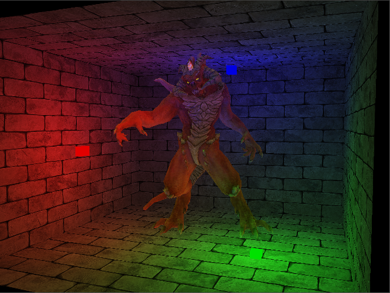

<p align="center">
  <a href="https://github.com/ZeusYang/TinySoftRenderer">
    
  </a>
  <h3 align="center">TinySoftRenderer</h3>
<p align="center">

</p>
  <p align="center">
    A tiny soft-renderer built from scratch using C++ 11
    <br />
    <a href="https://github.com/ZeusYang/TinySoftRenderer/blob/master/images/demo.gif">View Demo</a>
    <a href="https://github.com/ZeusYang/TinySoftRenderer/issues">Report Bug</a>
  </p>


## About The Project

The original intention of building such a 3D rendering system from scratch without any help of graphics library is to get a deeper understanding of the three-dimensional rendering process. We all know that only when we implement these algorithms by ourselves can we actually understand the principles behind what we observe. Computer graphics is a kind of rational romance as I see it!


### Built With

This project was totally refactored based on previous naive version I built 2 years ago. Now, I utilize the following third-party libraries to build this renderer. Please note that SDL2 is just for displaying the rendered results as well as handling mouse and key events.
* [SDL2](https://www.libsdl.org/)
* [GLM](https://github.com/g-truc/glm)
* [tinyobjloader](https://github.com/tinyobjloader/tinyobjloader)
* [stb_image](https://github.com/nothings/stb)
* [oneTBB](https://github.com/oneapi-src/oneTBB)


## Getting Started

I am trying to build it in a cross-platform manner. At present, I only tested building in both Windows 10 and Ubuntu 16.04 systems.

### Prerequisites

Please make sure your system is equipped with the following softwares.  

- [cmake](https://cmake.org/)：at least version 3.5

* Microsoft visual studio 2017 or 2019 (for windows) 
  
* SDL2 (for ubuntu)：
  
  ```sh
  sudo apt-get update
  sudo apt-get install libsdl2-2.0
  sudo apt-get install libsdl2-dev
  ```

### Installation

1. Clone the repo
   ```sh
   git clone https://github.com/ZeusYang/TinySoftRenderer.git
   ```
   
2. Use cmake to build the project：
   
   ```
   cd build
   cmake ..
   make
   ```
   
   or using cmake-gui is ok.


## Usage

Please check out `src/main.cpp` for more details. More examples are planned.


## Features

- Affine and perspective correct per vertex parameter interpolation.
- Bresenham, Edge equation triangle rasterization
- Phong/Blinn-Phong shading, point lights
- Textureing, Nearest texture sampling, Bilinear texture sampling
- Tiling and morton curve layout for texture
- Sutherland Hodgeman Homogeneous Cliping
- Tangent Space Normal Mapping
- Z-buffering


## ToDo

- Performance optimization
- Mipmap texturing
- MSAA
- Alpha Blending


## License

Distributed under the MIT License. See `LICENSE` for more information.


## Contact

yangwc3@mail2.sysu.edu.cn

