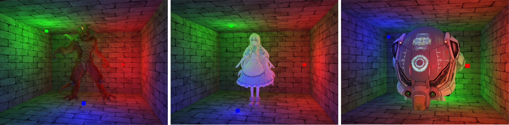
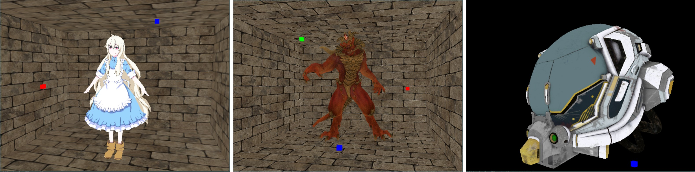
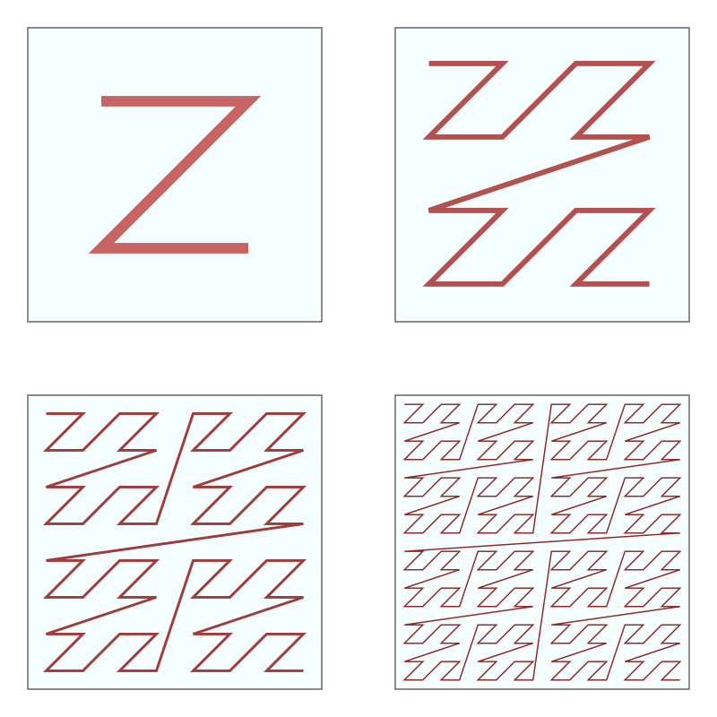
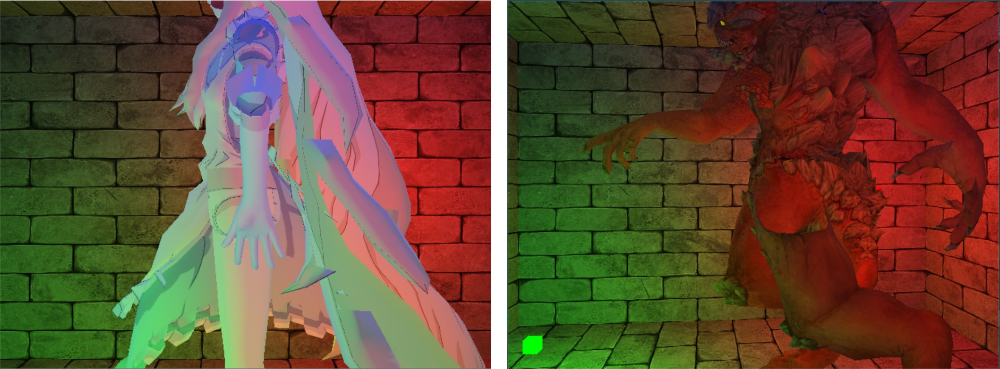

<p align="center">
  <a href="https://github.com/ZeusYang/TinySoftRenderer">
    
  </a>
  <h3 align="center">TinySoftRenderer</h3>
<p align="center">

</p>
  <p align="center">
    A tiny soft-renderer built from scratch using C++ 11
    <br />
    <a href="https://github.com/ZeusYang/TinySoftRenderer/blob/master/images/demo.gif">View Demo</a>
    <a href="https://github.com/ZeusYang/TinySoftRenderer/issues">Report Bug</a>
  </p>


## About The Project

The original intention of building such a 3D rendering system from scratch without any help of graphics library is to get a deeper understanding of the three-dimensional rendering process. 




### Built With

This project was totally refactored based on previous naive version I built 2 years ago. Now, I utilize the following third-party libraries to build this renderer. Please note that SDL2 is just for displaying the rendered results as well as handling mouse and key events.
* [SDL2](https://www.libsdl.org/)
* [GLM](https://github.com/g-truc/glm)
* [stb_image](https://github.com/nothings/stb)
* [assimp](https://github.com/assimp/assimp)
* [oneTBB](https://github.com/oneapi-src/oneTBB)


## Getting Started

### Prerequisites

At present, I build it on Windows platform. Please make sure your system is equipped with the following softwares.  

- [cmake](https://cmake.org/)：at least version 3.5

* Microsoft visual studio 2017 or 2019
  

### Installation

Please compile the project for **x64 platform**.

1. Clone the repo
   ```sh
   git clone https://github.com/ZeusYang/TinySoftRenderer.git
   ```
   
2. Use cmake to build the project：
   
   ```
   cd build
   cmake ..
   make
   ```
   
   or using cmake-gui is ok.

Please note that copy **external/dlls/*.dll** (for example: SDL2.dll) to the corresponding example binary directory for execution (like `build/Release`). Release mode is much more efficient than debug mode.


## Usage

Please check out `examples/` for more details. 


## Features

- Affine and perspective correct per vertex parameter interpolation.
- Accelerated edge function based triangle rasterization. Refs: [link](http://acta.uni-obuda.hu/Mileff_Nehez_Dudra_63.pdf)


- Texturing, Nearest texture sampling, Bilinear texture sampling



- Phong/Blinn-Phong shading, point lights


- Tiling and morton curve memory layout for texture. (But it turns out that high-frequency address mapping is also time-consuming...) Refs: [link1](https://en.wikipedia.org/wiki/Z-order_curve), [link2](https://fgiesen.wordpress.com/2011/01/17/texture-tiling-and-swizzling/)



- Mipmap texture, trilinear sampling. Refs: [link1](http://www.aclockworkberry.com/shader-derivative-functions/#footnote_3_1104), [link2](https://en.wikipedia.org/wiki/Mipmap)


- Sutherland Hodgeman Homogeneous Cliping. Refs: [link1](https://fabiensanglard.net/polygon_codec/clippingdocument/Clipping.pdf), [link2](https://fabiensanglard.net/polygon_codec/)

- Screen space back face culling (more robust compared to implementation in ndc space).



- Tangent Space Normal Mapping
- Z-buffering (Reversed z)
- Multi sampling anti-aliasing (MSAA 4X)


- Multi-thread parallelization using [tbb](https://github.com/oneapi-src/oneTBB) as backend


## ToDo

- Alpha Blending

- More light source type

  

## License

Distributed under the MIT License. See `LICENSE` for more information.


## Contact

yangwc3@mail2.sysu.edu.cn

